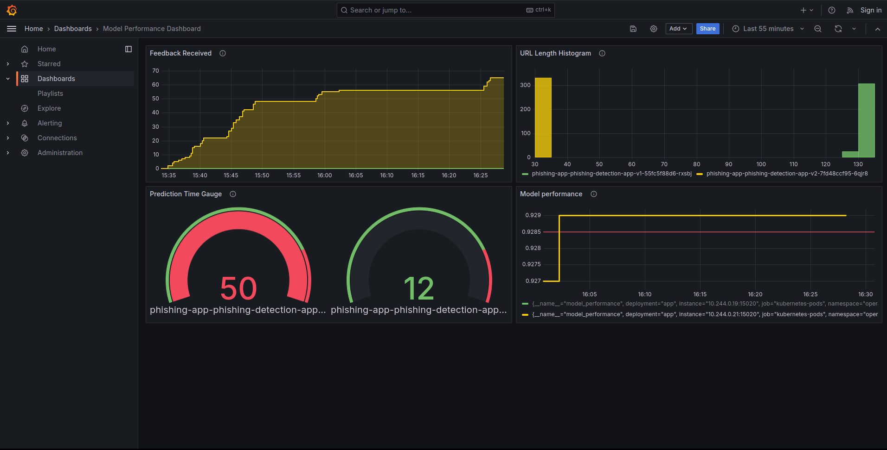

# remla24-team6
Operation repository for CS4295 Release Engineering for Machine Learning Applications (2023/24 Q4)

### Repositories

- operation: [operation](https://github.com/remla24-team6/operation/tree/main)
- model training: [phishing-detection-cnn](https://github.com/remla24-team6/phishing_detection_cnn/tree/main)
- model service: [model_service](https://github.com/remla24-team6/model-service/tree/main)
- app: [app](https://github.com/remla24-team6/app/tree/main)
- lib-version: [lib-version](https://github.com/remla24-team6/lib-version/tree/main)
- ml-lib: [ml-lib](https://github.com/remla24-team6/ml-lib/tree/main)

## Running via docker-compose:

1. Make sure that docker is installed.
2. Clone the repo
3. Perform the API Configuration as described [here](https://github.com/remla24-team6/model-service) (Create the `.flaskenv` file)
4. Navigate into the repo and run `docker-compose up`
5. Go to [http://0.0.0.0:8000/](http://0.0.0.0:8000/) and test the system.


## Provisioning

Make sure you have cloned this repository.

Make sure vagrant is installed along with an appropriate provider (e.g. VirtualBox).
To set up the nodes in the system, run:
```
vagrant up --provision
```
Sometimes vagrant is a bit flaky and does not set up the nodes properly. If this is the case, run:
```
vagrant destroy <malfunctioning node>
vagrant up --provision
```

The control node should be available on `192.168.60.2`. The worker nodes should be available on `192.168.61.2`, `192.168.61.3` ... etc. (If you configure more than 2 worker nodes)
Upon running `vagrant up --provision`, the ansible playbook should automatically be triggered for any node. Two attempts at provisioning (`playbook.yaml` and `ansible/provisioning.yaml`) have been made (with a lot of time and effort),
but neither of them worked in the end. Both install docker and a kubernetes distribution on the respective nodes, initialize a cluster in the control node and generate a join command.
Furthermore, in both cases, the join command is extracted in the worker node, but we did not manage to get the worker nodes to join the control nodes. However, we hope that these attempts display our efforts


## Running the application using Helm
1. Install minikube on your machine.
2. Start a local kubernetes cluster by running `minikube start --driver=docker`. Note: you can choose to give more resources to the cluster by adding flags `--memory=4096 --cpus=4`.
3. Install istioctl on your machine by running `istioctl install` after adding <path-to-istio>/bin to your PATH. For istio, make sure you install all the necessary add ons by running `kubectl apply -f <path-to-istio>/samples/addons/[prometheus/jaeger/kiali].yaml`.
4. Create namespace to run our project by running `kubectl create namespace operations`.
5. Add istio injection for the operations namespace by running `kubectl label ns operations istio-injection=enabled`.
6. Install the phishing-app using helm by running `helm install phishing-app ./phishing-app -n operations`. Note: The Helm chart supports namespaces
and can be installed more than once into the same cluster.
7. Check if the pods and servies are up by running `kubectl get pods -n operations` and `kubectl get services -n operations`.
8. Create a tunnel using `minikube tunnel` or use `kubectl port-forward svc/istio-ingressgateway -n istio-system 8000:80`
9. Apply ` kubectl apply -f prometheus.yml -n istio-system`.
10.  Now, run the app on `localhost`

**Note:** Helm install can take a long time to finish setting up.


### Grafana Dashboard

Our collected are metrics are model performance (Gauge), feedback collected (Counter), url length (Histogram), inference time (Summary).
To set up the dashboard, please:
1. Open Grafana using `istioctl dashboard grafana`.
2. Nabigate to `Dashboards`, on the top right, click "New" and click "Import" from the dropdown menu.
3. Upload the `dashboard-grafana.json` file. 




## Rate limiting
To enable rate limiting, run `kubectl apply -f <path-to-istio>/samples/ratelimit/rate-limit-service.yaml`. 
The server should respond with `429 Too Many Requests` if you send more than 10 requests in 1 minute.

## Comments 

### Comments for A1
For this week's submission we implemented the following activities:
- Converted the notebook into Python scripts.
- Add dvc pipeline to train the model.
- Add dvc metrics to the code base.
- Installed static code formatting tool autopep8.
- Installed and configured two linters (pylint & flake8) to check code quality.
- Display pylint code quality information in output file.

### Comments for A2
For this week's submission we implemented the following activities:
- Separated out the phishing pre-prcessing logic into a separate python package (ml-lib)
- Updated model training repository to use the pre-prcessing library. Added linters to github workflow.
- Created a new version-aware python library (lib-version) that can be imported in the app.
- Created a model-service that loads a trained model (which is stored in google drive) and exposes endpoints to predict using that model.
  This service uses the lib-ml python package for preprocessing. Implements Swagger for API documentation.
- Created a Django app that has both the app-frontend and the app-service (app)

### Comments for A3
For this week's submission we implemented the following activities:
- Uses Vagrant to define the virtual hardware and network setup through infrastructure as code.
- Applies Ansible to prepare the necessary runtime environment. Controller/node connections are not set up yet.
- Migrates the Docker compose deployment of our application.
- Uses Prometheus for monitoring.
- Creates a Grafana dashboard that shows our custom metrics.

  
### Comments for A4

NOTE: We skip the inference and memory test by default due to their computational expensiveness. Setting the flag `SKIP_<INFERENCE|MEMORY>_TEST=False` allows u to run the tests if desired.

For this week's submission we implemented the following activities:
- We have a test for non-determinism robustness.
- We have a test that uses data slices to test model capabilities.
- We have at least one test for each of the following angle:
  -  Feature and Data;
  -  Model Development;
  -  ML infrastructure;
  -  Monitoring tests. 
  -  Memory and Performance test.
- We have an initial mutamorphic test. 
  - Tests are triggered by running dvc repro.
  

  ### Comments for A5
- We extended the webapp by adding functionality to provide feedback w.r.t. the model's predictions.
- We use Istio for our deployments and use a `Gateway` and `Virtual Service` to make our web app accessible.
- `DestinationRules` are used to realise the canary release.
- We set up the infrastructure to run experiments. Our current experiment concerns the increased traffic when we style the front-end application.
- The additional use case is Rate Limiting. The service throttles excessive traffic from users.
  
